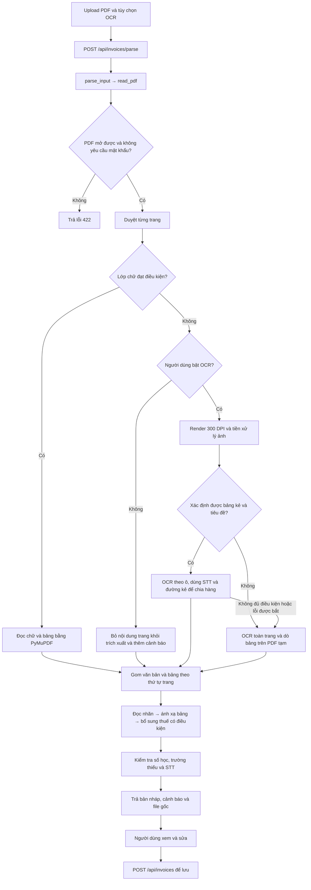

# Luồng xử lý hóa đơn PDF hiện tại

Tài liệu mô tả mã nguồn tại thời điểm hoàn tất sửa bộ đọc PDF, ngày 07/09/2026. Các ngưỡng bên dưới là giá trị đang dùng trong code, không phải cấu hình có thể thay đổi từ giao diện.

## 1. Phạm vi và kiến trúc

App phân tích từng trang PDF. Trang có lớp chữ đủ tốt được đọc trực tiếp bằng PyMuPDF; trang thiếu lớp chữ chỉ được OCR khi người dùng bật tùy chọn OCR. Sau đó văn bản và bảng được ánh xạ vào cùng cấu trúc dữ liệu hóa đơn đang dùng cho XML.

Toàn bộ xử lý PDF/OCR chạy cục bộ ở backend bằng PyMuPDF, Pillow, OpenCV và Tesseract. Luồng này không gọi mô hình AI, dịch vụ OCR bên ngoài, tra cứu hóa đơn hay đọc XML đi kèm để bổ sung dữ liệu.

| File | Trách nhiệm |
| --- | --- |
| [UploadCard.js](frontend/src/components/UploadCard/UploadCard.js) | Nhận file và lựa chọn OCR; gọi API phân tích; nhận bản nháp và cảnh báo. |
| [routes.py](backend/app/routes.py) | Tiếp nhận multipart upload, chuyển đến parser, trả JSON hoặc lỗi. |
| [parser.py](backend/app/parser.py) | Phân luồng theo định dạng; đóng gói kết quả, file gốc và trạng thái OCR. |
| [pdf_reader.py](backend/app/pdf_reader.py) | Đọc trang PDF, chọn nhánh OCR, nhận diện bảng scan và tổng hợp kết quả. |
| [invoice_text.py](backend/app/invoice_text.py) | Đọc thông tin chung, người bán, người mua và tổng tiền từ nhãn văn bản. |
| [invoice_tables.py](backend/app/invoice_tables.py) | Ánh xạ cột bảng thành dòng hàng, đọc tổng hợp bảng và kiểm tra số liệu. |
| [schema.py](backend/app/schema.py) | Cấu trúc hóa đơn và các trường mặc định. |
| [SummaryCard.js](frontend/src/components/SummaryCard/SummaryCard.js) | Hiển thị file gốc, bản nháp, dòng hàng, nguồn trang và cảnh báo để người dùng sửa/lưu. |
| [sqlite_db.py](backend/app/sqlite_db.py), [db.py](backend/app/db.py) | Lưu bản nháp khi người dùng bấm lưu, vào SQLite hoặc SQL Server. |



## 2. Tiếp nhận file và phân luồng

Frontend gửi `file` và `use_ocr` đến `POST /api/invoices/parse`. Backend hiểu các chuỗi `1`, `true`, `yes`, `on` là bật OCR; mặc định là tắt.

`parse_input(filename, content_type, payload, use_ocr)` từ chối file rỗng. Các nhánh được xét theo thứ tự XML, JSON, PDF, ảnh, văn bản, rồi định dạng khác. Nhánh PDF được chọn khi phần mở rộng là `.pdf` hoặc MIME là `application/pdf`, sau các nhánh XML/JSON. MIME dùng giá trị được truyền vào trước, rồi mới đoán từ tên file.

`read_pdf()` mở dữ liệu bytes bằng PyMuPDF. PDF hỏng/không mở được được chuyển thành `ValueError`; PDF yêu cầu mật khẩu cũng bị từ chối với thông báo tải bản đã mở khóa. Không có bước nhập mật khẩu trong giao diện.

API phân tích chỉ trả bản nháp, chưa ghi hóa đơn vào database. Thiếu file trả HTTP 400; `ValueError` hoặc `RuntimeError` từ parser được route chuyển thành HTTP 422. Những kiểu lỗi khác không được route này bắt riêng.

## 3. Quyết định dùng lớp chữ hay OCR cho từng trang

`read_pdf()` gọi `page.get_text(sort=True)`, sau đó `_usable_text()` kiểm tra:

| Điều kiện | Kết quả |
| --- | --- |
| Văn bản sau trim dưới 40 ký tự | Không đạt. |
| Số ký tự thay thế Unicode `U+FFFD` vượt 1% độ dài văn bản | Không đạt. |
| `page.get_text("words")` có dưới 10 từ | Không đạt. |
| Ảnh lớn nhất chiếm trên 65% diện tích trang **và** có dưới 80 từ | Không đạt; tránh xem lớp chữ của footer/chữ ký là nội dung đầy đủ của một trang scan. |
| Không rơi vào các điều kiện trên | Dùng lớp chữ. |

Đây là bộ điều kiện sơ bộ, không chứng minh lớp chữ phản ánh đầy đủ và đúng hình ảnh PDF.

- Nếu đạt: luôn dùng lớp chữ, kể cả khi OCR đang bật.
- Nếu không đạt và OCR bật: render riêng trang đó ở 300 DPI rồi gọi `ocr_page()`.
- Nếu không đạt và OCR tắt: thêm cảnh báo theo số trang và đặt văn bản trang thành chuỗi rỗng. Code hiện tại không giữ phần chữ thưa đó trong `extracted_text`; người dùng vẫn có file gốc để đối chiếu.

Các trang được xử lý tuần tự. Một PDF có thể kết hợp trang đọc trực tiếp và trang OCR. `ocr_used` chỉ trở thành `true` khi thực sự có trang đi qua nhánh OCR; `ocr_enabled` phản ánh lựa chọn của người dùng.

### Trường hợp PDF dùng chữ vector

Một PDF trông sắc nét vẫn có thể kết hợp ảnh nền với chữ được vẽ bằng đường nét vector (outline), thay vì chứa lớp text. Trong trường hợp này, `get_text()` trả về 0 ký tự, 0 từ và danh sách font rỗng, trong khi trang chứa hàng nghìn đối tượng đường vẽ. Nếu bỏ ảnh nền mà chữ vẫn hiển thị, phần chữ nhìn thấy nằm trong các đường vẽ và không có mã ký tự để trích xuất trực tiếp.

File không “thất bại cả bốn điều kiện”. `_usable_text()` trả `False` ngay tại điều kiện dưới 40 ký tự. Nếu đánh giá riêng từng điều kiện: số từ cũng không đạt; điều kiện ảnh lớn trên 65% và dưới 80 từ cũng không đạt, do ảnh nền chiếm khoảng 71–80% trang. Nhưng số ký tự lỗi `U+FFFD` là 0, nên điều kiện tỷ lệ ký tự lỗi không kích hoạt. Chỉ cần một điều kiện loại là đủ chuyển nhánh; code không yêu cầu cả bốn cùng xảy ra.

Đối với chữ outline, phóng to vẫn sắc vì trình xem vẽ các đường cong, nhưng không có mã ký tự/font để `get_text()` trả về. OCR cần nhận dạng hình dáng chữ sau khi render. Luồng hiện tại render toàn trang, chưa có bước riêng tự bỏ ảnh nền cho loại PDF outline này. Việc bỏ ảnh để kiểm tra nêu trên chỉ thực hiện trong bộ nhớ, không sửa file hóa đơn gốc.

## 4. Đọc bảng từ PDF có lớp chữ

`_tables()` gọi `page.find_tables()` với chiến lược mặc định của PyMuPDF. Không có nhánh tự chuyển sang chiến lược bảng không kẻ `strategy="text"` trong code hiện tại.

Mỗi bảng chỉ được giữ nếu có ít nhất một hàng mà `header_columns()` nhận diện đủ năm cột bắt buộc: `STT`, `THHDVu`, `SLuong`, `DGia`, `ThTien`.

Bảng trung gian gồm:

```text
page: số trang, bắt đầu từ 1
method: "PDF table"
rows: ma trận nội dung ô từ table.extract()
bboxes: bounding box của từng hàng
```

Nội dung nhiều dòng trong một ô được giữ đến bước ánh xạ. Nếu dò bảng phát sinh exception trong nhánh lớp chữ, app giữ văn bản trang và thêm cảnh báo không phân tích được bảng. Nếu chỉ không tìm thấy bảng, nhánh này không tự chạy lại OCR, ngay cả khi người dùng bật OCR.

## 5. Tiền xử lý và nhận diện cấu trúc trang scan

### 5.1. Cấu hình Tesseract

`_tesseract()` ưu tiên `TESSERACT_CMD` nếu được cấu hình. Nếu thư mục `backend/tessdata` tồn tại, thư mục này được dùng làm nguồn language pack.

Ngôn ngữ chọn trong số các gói đang có: `vie+eng`, chỉ `vie`, hoặc chỉ `eng`. Không có cả hai thì báo lỗi; chỉ có tiếng Anh thì thêm cảnh báo thiếu tiếng Việt. Dockerfile cài Tesseract và hai gói `vie`, `eng`.

### 5.2. Chuẩn bị ảnh

`_prepare_image()` thực hiện:

1. Áp dụng hướng EXIF, chuyển sang RGB.
2. Thu nhỏ nếu cạnh dài nhất vượt 4.500 pixel, giữ tỷ lệ.
3. Chuyển xám và tạo mask bằng ngưỡng Otsu đảo màu.
4. Dùng `HoughLinesP` tìm đoạn thẳng: bước khoảng cách 1 pixel, bước góc `π/1800`, ngưỡng 100, chiều dài tối thiểu bằng 1/4 chiều rộng ảnh, khoảng đứt tối đa 20 pixel.
5. Chỉ xét góc nghiêng trong ±7°. Lấy trung vị; nếu trị tuyệt đối lớn hơn 0,15° thì xoay ảnh, mở rộng nền trắng và nội suy bicubic.

Sau đó `ocr_page()` thử nhận diện hướng bằng `image_to_osd()`, timeout 15 giây. Chỉ xoay theo kết quả OSD khi `orientation_conf >= 5` và có góc xoay khác 0. Lỗi Tesseract/timeout ở bước xác định hướng được bỏ qua.

Ảnh sau chỉnh hướng được dùng để dò đường kẻ. Một bản khác dùng để OCR được chuyển thành đen/trắng: mức xám trên 170 thành trắng, phần còn lại thành đen. Tách hai bản này giúp bước OCR giảm nền hoa văn mà bước dò bảng vẫn còn các đường kẻ nhạt.

### 5.3. Dò đường kẻ: `_grid_lines()`

- Adaptive threshold Gaussian đảo màu, block size 35, hằng số trừ 15.
- Xử lý hai hướng ngang/dọc riêng. Morphological close dùng kernel `(12,1)` hoặc `(1,8)` để nối các đoạn đứt.
- Morphological open dùng kernel dài `max(30, kích_thước_theo_hướng / 30)`.
- Chỉ giữ contour có chiều dài đạt ngưỡng kernel và tỷ lệ dài/dày lớn hơn 5.
- Chuyển đoạn thẳng sang hệ tọa độ của trang được truyền vào bằng tỷ lệ kích thước ảnh/trang.

### 5.4. Xác định vùng bảng: `_raster_cells()`

Hàm tạo trang PyMuPDF tạm có kích thước bằng số pixel của ảnh để tính hình học. Nó chọn các đường dọc dài hơn 15% chiều cao ảnh, gom nhóm theo điểm bắt đầu dọc lệch dưới 1,2% chiều cao ảnh, rồi chọn nhóm đông nhất có ít nhất sáu đường.

Các vị trí gần nhau được gom với khoảng cách tối đa 8 pixel và lấy trung vị. Vùng ứng viên cần ít nhất sáu tọa độ cột, rộng ít nhất 50% chiều rộng ảnh. Mép trên lấy trung vị điểm bắt đầu của nhóm; mép dưới lấy điểm kết thúc thấp nhất về giá trị y trong nhóm, tức đường ngắn nhất.

Các đường ngang dài hơn 50% bề rộng vùng bảng, nằm trong vùng trên/dưới với dung sai 8 pixel, tạo ranh giới hàng ban đầu. Cần ít nhất ba tọa độ hàng. Không đủ điều kiện thì trả `None` để chuyển sang OCR toàn trang.

Điều kiện này hướng đến bảng có đường kẻ và nhiều cột. Đây không phải bộ nhận diện mọi bố cục hoặc bộ giải mã QR; một trang chỉ chọn một nhóm bảng raster ứng viên chính.

## 6. OCR theo ô và khôi phục ranh giới hàng

### 6.1. Xác nhận tiêu đề và tìm mốc STT

`_ocr_ruled_table()` OCR hai hàng hình học đầu tiên để kiểm tra tiêu đề. Hàng đầu phải nhận diện đủ cột bắt buộc. Nếu ô mô tả ở hàng kế tiếp là `2` hoặc `(2)`, coi đó là hàng đánh số cột/công thức và bắt đầu dữ liệu sau hàng này; nếu không, bắt đầu sau tiêu đề.

Cột STT của phần dữ liệu được OCR riêng bằng `image_to_data()`, `--psm 6`, whitelist `0123456789`, timeout 90 giây. Ưu tiên ngôn ngữ `eng` cho cột này nếu có. Tâm dọc của các token toàn chữ số tạo mốc vị trí hàng.

Khi có trên một mốc, hàm dò lại đường kẻ trên **ảnh trước khi làm trắng nền** và tìm ranh giới giữa từng cặp mốc STT:

- Gom đường ngang theo vị trí y làm tròn theo bước 6 pixel.
- Chỉ xét đường nằm giữa hai mốc, cách mỗi mốc hơn 4 pixel.
- Tổng độ phủ ngang của các đoạn hợp lại phải vượt 30% bề rộng bảng.
- Ưu tiên vị trí có độ phủ lớn nhất; nếu bằng nhau, chọn vị trí gần trung điểm hai mốc hơn.
- Không có ứng viên đạt điều kiện thì bỏ nhánh OCR theo ô, không tự chia tại trung điểm.

Các ranh giới tiêu đề và phần cuối còn lại được giữ từ hình học ban đầu. Nếu có tối đa một mốc STT thì giữ cách chia hàng ban đầu.

### 6.2. Đọc ô theo lô: `_ocr_cell_batches()`

Mỗi lần xử lý tối đa 18 ô. Mỗi ô được crop lùi 4 pixel so với bốn mép nhằm tránh đường viền. Các crop được ghép dọc vào một ảnh trắng tạm, có khoảng cách 50 pixel giữa các ô; ảnh có phần đệm ngang 60 pixel, các crop bắt đầu tại x=25 và y=20.

Tesseract đọc ảnh ghép bằng `image_to_data()`, `--psm 6 --dpi 300`, timeout 90 giây cho mỗi lô. Token được trả về ô dựa trên tâm dọc của bounding box nằm trong vùng crop nào, không ghép chỉ dựa vào chuỗi văn bản toàn trang.

Giá trị ô là các token nối bằng khoảng trắng, giữ thứ tự Tesseract trả về. Độ tin cậy của ô là **giá trị nhỏ nhất** trong các token của ô; ô không có token nhận 0. Đây không phải xác suất đã hiệu chuẩn.

Kết quả được tạo lại thành ma trận hàng/cột và kiểm tra tiêu đề lần nữa. Bảng trung gian có `method="OCR cells"`, `rows`, `bboxes`, và ma trận `confidence`.

### 6.3. Nội dung ngoài bảng

Nếu bảng theo ô hợp lệ:

- Vùng phía trên bảng được OCR bằng `image_to_string(..., --psm 3)`.
- Vùng phía dưới bảng được OCR bằng `image_to_string(..., --psm 6)`.
- Hai vùng đều bị giới hạn ngang bởi mép trái/phải của vùng bảng ứng viên.
- Văn bản trang trả về là phần đầu + các hàng bảng nối ô bằng ` | ` + phần cuối.
- Thêm cảnh báo trang dùng OCR theo ô và cần đối chiếu file gốc.

## 7. Nhánh dự phòng: OCR toàn trang

Nhánh này chạy khi không xác định được hình học bảng, không xác nhận được tiêu đề/ranh giới hàng, hoặc nhánh theo ô gặp `TesseractError`, `RuntimeError`, `ValueError` được bắt trong `ocr_page()`.

Tesseract gọi `image_to_pdf_or_hocr(extension="pdf", --psm 3 --dpi 300)` trên ảnh đen/trắng, timeout 90 giây. PDF có lớp chữ do OCR tạo ra chỉ dùng trong bộ nhớ:

1. Mở bằng PyMuPDF.
2. Đọc chữ với `get_text(sort=True)`.
3. Gọi `_tables()` với các đường kẻ raster chuyển thành `add_lines`.
4. Giữ những bảng có tiêu đề hợp lệ, ghi `method="OCR table"`.
5. Thêm cảnh báo trang dùng OCR.

Nhánh này không cung cấp ma trận độ tin cậy ô như `OCR cells`. Nếu Tesseract toàn trang thất bại/timeout, parser báo lỗi kèm số trang; không có cơ chế trả thành công riêng các trang trước đó. Exception từ dò bảng ở nhánh dự phòng cũng không có khối bắt riêng như nhánh PDF có lớp chữ.

## 8. Gom các trang và đọc trường văn bản

`_finish()` nối văn bản theo thứ tự trang, dùng `\n\f\n` làm dấu phân trang rồi trim toàn chuỗi. Khởi tạo `invoice_template()` và gọi `document_from_text()` trước khi ánh xạ bảng. Trường chưa có dữ liệu giữ giá trị mặc định, thường là `""` hoặc `[]`.

### 8.1. Đọc nhãn, tránh gán nhầm trường

`compact()` chuẩn hóa Unicode NFC và khoảng trắng. `fold_accents()` bỏ dấu để so khớp nhãn, trong khi giá trị lấy từ chuỗi gốc vẫn giữ dấu được trích xuất.

`label_values()` xử lý từng dòng, nhận cả nhãn tiếng Việt và một số nhãn tiếng Anh/song ngữ. Mẫu nhãn chính yêu cầu dấu `:` hoặc `：`, cho phép phần chú thích trong ngoặc. Giá trị kết thúc trước nhãn tiếp theo cùng dòng. Vì vậy:

```text
Điện thoại (Tel): 0987654321 Fax: Website:
```

được tách thành số điện thoại, Fax rỗng và Website rỗng. Fax/Website không lấy giá trị từ dòng kế tiếp.

Chế độ nối dòng chỉ bật khi đọc vùng người bán/người mua. Một dòng không có nhãn mới có thể nối tiếp nhãn `seller`, `buyer`, `address`, `bank`; dòng chứa `:`, `HÓA ĐƠN`, `Ngày `, `Người `, `Ghi chú`, `STT` bị loại khỏi việc nối. Đây là quy tắc theo văn bản, không phải mô hình nhận diện vùng key-value bằng tọa độ.

Hàm `value_after_label()` vẫn được giữ để tương thích với các lời gọi nhãn regex tùy chỉnh; luồng `document_from_text()` hiện dùng `label_values()`.

### 8.2. Chia người bán và người mua

Thông tin chung và hai bên được đọc từ phần văn bản đầu tiên trước `\f`, rồi cắt trước từ `STT` đầu tiên. Vì toàn văn đã trim, các trang rỗng ở đầu có thể không còn dấu phân trang đầu trong chuỗi cuối.

Vị trí đầu tiên có nhãn họ tên người mua, tên đơn vị hoặc đơn vị mua hàng là mốc chia người bán/người mua. Mỗi trường lấy lần xuất hiện đầu trong vùng, kể cả giá trị rỗng. Không lấy lần lặp người bán/người mua ở các trang tiếp theo để bổ sung trường còn thiếu.

| Nhãn | Trường |
| --- | --- |
| Đơn vị bán hàng / tên đơn vị mua | `NBan.Ten` / `NMua.Ten` |
| Mã số thuế | `MST`; chỉ lấy phần đầu khớp 10 chữ số, có thể thêm `-` và 3 chữ số. |
| Địa chỉ, điện thoại, email | `DChi`, `SDThoai`, `DCTDTu` |
| Số tài khoản, ngân hàng | `STKNHang`, `TNHang` |
| Fax, Website | Chỉ ánh xạ nếu trường có trong cấu trúc bên tương ứng, hiện là người bán. |
| Họ tên người mua | `NMua.HVTNMHang` |

Nếu giá trị số tài khoản chứa tiếp từ “Ngân hàng” không có dấu `:`, hàm tách phần đó thành tên ngân hàng. Nếu không có tên người bán theo nhãn, chỉ xét dòng ngay trước “Mã số thuế” và nhận khi dòng bắt đầu bằng “CÔNG TY”, “DOANH NGHIỆP”, “HỘ KINH DOANH” hoặc “CHI NHÁNH”.

### 8.3. Thông tin chung và tổng hợp từ chữ

- Ánh xạ số hóa đơn, ký hiệu, ngày lập, hình thức thanh toán, tiền tệ vào `TTChung`.
- Ngày dạng “Ngày … tháng … năm …” có/không có chú thích tiếng Anh hoặc `dd/mm/yyyy` được chuyển thành `yyyy-mm-dd`. Ngày không hợp lệ khi chuyển bị để rỗng; các chuỗi ngày khác chưa có nhánh chuẩn hóa riêng.
- Khi tiền tệ rỗng và phần đầu chứa “HÓA ĐƠN” hoặc “Mã số thuế”, mặc định `VND`.
- Tổng tiền trước thuế, thuế và thanh toán chỉ lấy từ nhãn khi phần giá trị là một chuỗi số đơn với dấu chấm/phẩy, không nhận một dòng chứa ba số tách bằng khoảng trắng.
- Tiền bằng chữ lấy nhãn đầu tiên có giá trị; chưa nối nội dung tiền bằng chữ bị xuống dòng.
- `MCCQT` lấy token chữ/số đầu tiên sau nhãn mã cơ quan thuế; chưa sửa khoảng trắng/ký tự OCR sai bên trong mã và chưa xác minh mã.

## 9. Ánh xạ bảng thành dữ liệu hóa đơn

`apply_tables()` duyệt bảng và hàng theo thứ tự đã gom từ các trang. Mỗi bảng bắt đầu với ánh xạ cột rỗng; gặp hàng tiêu đề hợp lệ thì cập nhật ánh xạ và bỏ hàng tiêu đề khỏi dữ liệu.

| Cột nhận diện | Trường dòng hàng |
| --- | --- |
| STT / No. | `STT` |
| Tên hàng / Description | `THHDVu` |
| Đơn vị / Unit | `DVTinh` |
| Số lượng / Quantity | `SLuong` |
| Đơn giá / Unit price | `DGia` |
| Thành tiền / Amount | `ThTien` |
| Thuế suất / Tiền thuế | `TSuat` / `TThue` |
| Tỷ lệ chiết khấu / Tiền chiết khấu | `TLCKhau` / `STCKhau` |

Tiêu đề tiếng Việt được so sánh không phân biệt dấu/hoa thường; nhãn tiếng Anh có các regex dự phòng. Năm cột bắt buộc là STT, mô tả, số lượng, đơn giá, thành tiền. Các cột còn lại có thể vắng.

Phân loại dòng:

- Bỏ hàng rỗng; bỏ hàng có mô tả rỗng hoặc chỉ là số, có thể nằm trong ngoặc, để tránh hàng đánh số cột.
- STT chỉ gồm chữ số: `TChat="1"`.
- STT rỗng, có mô tả, đồng thời số lượng/đơn giá/thành tiền đều rỗng: `TChat="4"`, giữ như ghi chú.
- STT không rõ nhưng có mô tả và ít nhất một giá trị số lượng/đơn giá/thành tiền: giữ nguyên, `TChat=""`, thêm cảnh báo cần kiểm tra STT.
- Các trường hợp còn lại bị bỏ qua.

Dòng mới được tạo từ bản sao `ITEM_FIELDS`, rồi điền các ô tương ứng. Mô tả được nối khoảng trắng; riêng dấu `/` ngay trước xuống dòng trong cùng ô được nối liền với từ kế tiếp, tránh làm đứt mã hợp đồng.

Các dòng được nối vào `NDHDon.DSHHDVu`. “Ghép bảng nhiều trang” ở đây là nối các dòng đã nhận diện theo thứ tự; không tự suy luận rằng hai mảnh mô tả ở hai trang thuộc cùng một dòng hàng. STT trùng không bị tự xóa.

### Tổng hợp tiền trong bảng

Các hàng tổng hợp được xét trước khi ánh xạ thành dòng hàng. Ô rỗng/ô gộp được bỏ khỏi danh sách giá trị dùng nhận diện:

- “Tổng cộng” với đúng ba giá trị số sau nhãn: gán lần lượt `TgTCThue`, `TgTThue`, `TgTTTBSo`.
- “Cộng tiền hàng” hoặc “Tổng tiền chưa thuế” với một số: gán `TgTCThue`.
- “Tổng cộng tiền thanh toán” hoặc “Tổng tiền thanh toán” với một số: gán `TgTTTBSo`.
- Hàng có ô bắt đầu bằng “Tiền thuế GTGT” và một số: gán `TgTThue`.
- Hàng “Thuế suất …%” với ba số: bổ sung `{TSuat, ThTien, TThue}` vào `THTTLTSuat`, lấy hai số đầu; bỏ bản ghi trùng hoàn toàn.

Các hàng tổng hợp chính đặt lại ánh xạ cột để phần tổng tiền không bị coi là hàng hóa. Vì `_tables()` lọc bảng theo tiêu đề hàng hóa, một bảng tổng hợp hoàn toàn tách riêng không có tiêu đề đó có thể không đi vào bước này; khi ấy chỉ còn nhánh đọc nhãn văn bản.

## 10. Bổ sung thuế có điều kiện

Sau khi đọc bảng, `_finish()` áp dụng hai quy tắc, không dùng XML và không tính ngược từ tổng tiền:

1. Nếu toàn văn chỉ có một giá trị thuế suất dạng số `%` lấy từ nhãn `rate`, và `THTTLTSuat` đang rỗng: dùng thuế suất đó cho những dòng `TChat="1"` còn thiếu `TSuat`. Nếu đã có cả tổng trước thuế và tổng thuế, đồng thời tạo một nhóm thuế suất từ hai tổng này. Nếu bảng đã tạo `THTTLTSuat`, quy tắc này không chạy.
2. Nếu chỉ có đúng một dòng `TChat="1"`, dòng thiếu `TThue`, hóa đơn có tổng thuế, và thành tiền dòng đọc được bằng tổng trước thuế: lấy tổng thuế làm tiền thuế dòng. Thêm một trường `TTKhac` giải thích nguồn tiền thuế dòng.

Đây là hai phép gán có điều kiện từ thông tin hiển thị ở phần tổng hợp; những trường kỹ thuật XML không xuất hiện trên PDF vẫn để mặc định.

## 11. Kiểm tra số liệu và cảnh báo

`decimal_value()` chỉ phục vụ đọc số theo định dạng Việt Nam trong bộ kiểm tra PDF. Nó bỏ khoảng trắng, chấp nhận dấu `+`/`-`, dấu chấm phân nhóm đủ ba chữ số và dấu phẩy thập phân, rồi chuyển thành `Decimal`.

| Chuỗi | Kết quả kiểm tra |
| --- | --- |
| `1.234.567,89` | `Decimal("1234567.89")` |
| `0,2529` | `Decimal("0.2529")` |
| `1.021` | `Decimal("1021")` |
| `224.1`, `6.`, `O0` | Không hợp lệ, trả `None`. |

Chuỗi trên form không bị thay bằng số `Decimal`. Bộ chuẩn hóa số của repository khi lưu database là logic riêng; không nên coi kết quả lập chỉ mục của repository là xác nhận OCR đúng.

`validate_document()` chỉ kiểm tra dòng `TChat="1"`:

- Cảnh báo STT trùng; cảnh báo dãy STT số không liên tục từ 1.
- Cảnh báo số lượng, đơn giá hoặc thành tiền thiếu/không hợp lệ.
- Kiểm tra `số lượng × đơn giá - tiền chiết khấu` với thành tiền nếu không có tỷ lệ chiết khấu và tiền chiết khấu rỗng hoặc đọc được. Có tỷ lệ chiết khấu thì bỏ kiểm tra phép nhân này.
- Kiểm tra tổng thành tiền với tổng trước thuế chỉ khi đọc được thành tiền của tất cả các dòng đang xét.
- Kiểm tra tổng tiền thuế dòng với tổng thuế chỉ khi mọi dòng đang xét có tiền thuế đọc được.
- Kiểm tra trước thuế + thuế với tổng thanh toán khi đọc được cả ba số. Chưa áp dụng đầy đủ công thức phụ phí/chiết khấu toàn hóa đơn; cảnh báo nhắc kiểm tra các khoản này.
- Chỉ cảnh báo lệch số học khi trị tuyệt đối của chênh lệch **lớn hơn 1** đơn vị tiền.
- Nếu có dòng trong bảng nhưng tổng thanh toán không đọc được, thêm cảnh báo.

Không có bước tự sửa số để ép phép tính khớp. Không kiểm tra riêng phép tính tiền thuế = thành tiền × thuế suất ở từng dòng.

Ngoài ra, app cảnh báo khi có văn bản nhưng không có dòng bảng, thiếu số hóa đơn/ngày lập, hoặc ô số OCR theo ô có confidence dưới 70. Confidence thấp được xét cho `SLuong`, `DGia`, `ThTien`, `TThue` khi ô có giá trị; chưa cảnh báo từng ô mô tả/tên dựa trên confidence.

Các cảnh báo giống hệt nhau được loại trùng ở cuối `_finish()`, giữ thứ tự xuất hiện. Cảnh báo không tự chặn thao tác lưu.

## 12. Nguồn trích xuất và kết quả trả về

Mỗi dòng đọc từ bảng có `TTKhac` mô tả trang/phương pháp và một object `ExtractionSource`:

```json
{
  "page": 1,
  "method": "PDF table",
  "bbox": [16.7, 344.6, 550.2, 383.2]
}
```

Với `OCR cells`, object còn có `confidence` theo từng trường được ánh xạ. `bbox` là hình chữ nhật cả hàng, không phải tọa độ riêng từng ô.

Tọa độ cần được hiểu theo nguồn: `PDF table` lấy tọa độ PyMuPDF; `OCR table` lấy tọa độ PDF tạm; `OCR cells` nhân tọa độ pixel của ảnh đã tiền xử lý với `0.24` (72/300). Nếu ảnh bị thu nhỏ hoặc xoay, code chưa đổi ngược tọa độ về PDF gốc. Giao diện hiện chỉ hiển thị số trang, chưa dùng các box này để highlight trên file gốc.

`read_pdf()` trả `(document, extracted_text, warnings, ocr_used)`. `parse_input()` đóng gói:

| Thuộc tính | Ý nghĩa |
| --- | --- |
| `filename`, `content_type` | Tên và loại file. |
| `parser` | `PDF bố cục và bảng` hoặc `PDF bố cục + OCR`. |
| `ocr_enabled` | Người dùng có bật OCR hay không. |
| `ocr_used` | Có ít nhất một trang thực sự dùng OCR hay không. |
| `extracted_text` | Văn bản đã gom, có dấu phân trang. |
| `document` | Cây `TTChung`, `NDHDon`, `MCCQT`, `DSCKS`. |
| `source_base64` | File upload ban đầu, không phải PDF OCR tạm. |
| `warnings` | Các vấn đề cần người dùng đối chiếu. |

## 13. Giao diện, lưu dữ liệu và vận hành

Từ 10/09/2026, giao diện gửi `POST /api/invoices/parse-jobs` và nhận HTTP 202 cùng mã tác vụ ngay sau upload. Backend chạy parser trong tiến trình con riêng (spawn), tránh dùng PyMuPDF đồng thời trong các thread. `GET /api/invoices/parse-jobs/<id>` trả trạng thái `queued`, `running`, `completed` (kèm `result`) hoặc `failed` (kèm `error`), với `Cache-Control: no-store`. Endpoint đồng bộ `/api/invoices/parse` vẫn giữ để tương thích; giao diện không dùng endpoint này.

Frontend hỏi trạng thái mỗi 2 giây với `?summary=1`, timeout 20 giây. Phản hồi này không chứa kết quả hay PDF base64, kể cả khi OCR đã xong. Khi hoàn tất, frontend tải riêng `GET /api/invoices/parse-jobs/<id>/result` với timeout 120 giây. Nếu còn file đã upload trong bộ nhớ trình duyệt, gửi `include_source=0` để chỉ nhận dữ liệu OCR rồi dùng FileReader bổ sung lại `source_base64` từ đúng file gốc. Khi tải lại trang và không còn file trong bộ nhớ, tải kết quả đầy đủ. Bản nháp cuối cùng vẫn chứa file gốc để xem trước và lưu như trước.

Việc tách này sửa lỗi phản hồi trạng thái tăng từ vài chục byte lên nhiều MB khi OCR hoàn tất: request vốn chỉ có 20 giây bị timeout trong lúc tải PDF gốc, khiến giao diện lặp lại thông báo mất kết nối dù OCR đã xong. Khi mất kết nối hoặc HTTP 5xx, thử lại sau 5 giây; sau sáu lần lỗi liên tiếp hoặc 90 giây không nhận được dữ liệu, dừng tự thử và hiện nút kết nối lại. Mã tác vụ vẫn giữ trong `sessionStorage`; kết nối lại không upload file mới. Trạng thái hiển thị trang đang OCR và được bố trí trong luồng trang, không chồng lên hướng dẫn.

Trạng thái/kết quả tạm lưu trong `parse_jobs.db` cùng thư mục SQLite hóa đơn, có thể đổi bằng `PARSE_JOBS_PATH`. Các Gunicorn worker dùng chung file này. Mặc định một tác vụ đang chờ/chạy, chỉnh bằng `PARSE_MAX_ACTIVE`; vượt giới hạn trả HTTP 429. Tiến trình giám sát kiểm tra OCR mỗi 5 giây, ghi heartbeat vào bảng `job_progress`, phát hiện tiến trình con bị dừng và giới hạn tổng thời gian mặc định 1800 giây (`PARSE_JOB_TIMEOUT`). Khi API thấy heartbeat cũ hơn 120 giây, tác vụ chuyển sang thất bại để không chờ vô hạn sau khi backend khởi động lại. Kết quả hoàn tất không bị ghi đè bởi giám sát. OpenCV dùng một thread và Tesseract mặc định `OMP_THREAD_LIMIT=1` trong tiến trình OCR để giảm tranh CPU.

Kết quả hết hạn sau một giờ, bản ghi tác vụ đang chạy có hạn hai giờ; các bản ghi hết hạn được xóa khi nhận tác vụ mới. Đây là bộ chạy demo trên một máy: tiến trình con không tự khôi phục khi backend/runtime dừng. Bản nháp chỉ thành hóa đơn đã lưu khi người dùng bấm lưu như trước. Notebook có ô chẩn đoán riêng kiểm tra backend, Nginx, Cloudflare, heartbeat và log; ô dừng mặc định không tắt demo khi Run all.

Frontend chuyển sang màn hình bản nháp sau khi phân tích. Cảnh báo được hiển thị cả qua thông báo và trên bản nháp. Người dùng xem PDF gốc/văn bản trích xuất, chỉnh trường rồi mới lưu.

Tên đơn vị, địa chỉ, mô tả hàng, tiền bằng chữ và ngân hàng dùng ô nhiều dòng với tối đa tám dòng hiển thị. Dòng hàng có nhãn trang nguồn khi có `ExtractionSource.page`; dòng `TChat="4"` được ghi là “Ghi chú”.

`POST /api/invoices` lưu file gốc, văn bản và `DocumentJson`, đồng thời tạo các bản ghi dòng hàng/trường mở rộng. `ExtractionSource` nằm trong JSON nên được giữ mà không cần thêm cột database. Các thuộc tính cấp bản nháp như `warnings`, `parser`, `ocr_used` hiện không có trường lưu riêng tương ứng; database lưu `OcrEnabled`. Vì thế thông tin trạng thái dựng lại khi mở hóa đơn đã lưu không đầy đủ như bản nháp mới phân tích. Sửa/lưu bản nháp không tự gọi lại `validate_document()`.

Hóa đơn đã lưu không tự phân tích lại khi cập nhật mã nguồn. Muốn dùng bộ đọc mới cho một file cũ, cần upload lại file đó.

Các giới hạn chờ đang dùng:

- Upload tạo tác vụ ở frontend: 120.000 ms; thời gian OCR không nằm trong request upload.
- Nginx `proxy_read_timeout`: 600 giây.
- Gunicorn timeout trong hai Dockerfile backend: 600 giây; SQLite dùng một worker, SQL Server dùng hai worker.
- Tesseract: phần lớn lời gọi là 90 giây/lần, OSD là 15 giây/lần. Đây không phải ngân sách tổng cho cả PDF, vì mỗi trang có thể gọi OCR nhiều lần.
- Frontend healthcheck dùng `http://127.0.0.1/` để tránh lỗi phân giải `localhost` sang IPv6 trong container.

Luồng đọc ảnh dùng chung `ocr_page()` và `_finish()`; `read_image()` duyệt từng frame, nên ảnh nhiều frame có thể đi qua cùng cách gom dữ liệu. XML/JSON vẫn được parse trực tiếp; TXT/CSV chỉ đi qua bộ đọc nhãn văn bản, không qua nhận diện hình học bảng PDF.

## 14. Giới hạn cần biết khi bảo trì

- Bảng không kẻ, nhiều bảng scan trên một trang, hàng bị cắt qua trang, tiêu đề không thuộc các nhãn hỗ trợ có thể không được đọc đầy đủ.
- Văn bản người bán/người mua dùng quy tắc chia theo nhãn và dòng; thiếu/sai nhãn có thể làm chia vùng sai. Chưa có kiểm chứng tự động cho mọi tên, địa chỉ, mã cơ quan thuế hoặc lỗi dấu tiếng Việt.
- Bộ lọc nền ngưỡng 170 có thể làm mất chữ nhạt. Các ngưỡng hình học và OCR hiện cố định, chưa có điều chỉnh theo từng nhà cung cấp trên giao diện.
- Không có fallback từ lớp chữ đạt điều kiện sang OCR chỉ vì bảng không đọc được. Không có cơ chế lấy phần thiếu từ XML hay lấy header tốt hơn ở trang khác.
- Không có cảnh báo cho mọi lỗi có thể xảy ra: chẳng hạn tổng tiền khớp vẫn không chứng minh mô tả đúng, và các dòng chưa phân loại không tham gia tổng dòng `TChat="1"`.
- Kết quả OCR luôn là bản nháp cần đối chiếu. Số lượng có thể bị nhận nhầm dấu thập phân, chẳng hạn `224.1` thay cho `224,1`; bộ kiểm tra định dạng sẽ cảnh báo nhưng không tự sửa. Tên, mô tả và tiền bằng chữ vẫn có thể sai dấu.
- Bộ đọc không xác minh chữ ký số hoặc tính hợp lệ pháp lý của hóa đơn. `DSCKS` của nhánh PDF giữ cấu trúc mặc định.

Khi mở rộng, điểm sửa tương ứng là `LABELS`/`document_from_text()` cho nhãn; `header_columns()`/`apply_tables()` cho cột và tổng hợp; `_usable_text()` cho lựa chọn nhánh; `_grid_lines()`/`_raster_cells()`/`_ocr_ruled_table()` cho hình học scan; `validate_document()` cho quy tắc kiểm tra.
